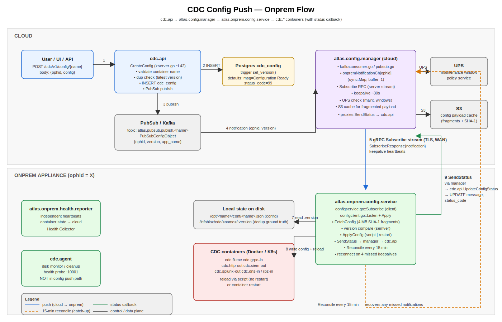
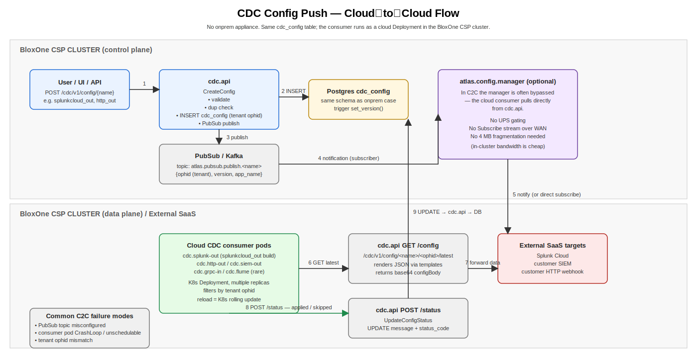

# CDC Config Push — End-to-End Reference

This folder explains how a CDC service configuration travels from a user
request all the way to a running container, for **both onprem and
cloud‑to‑cloud** deployments. It is written so that a new on‑call engineer
can use it as a debugging map when "the DB has the latest version but the
config has not reached the destination".

> Written: 2026‑04‑23. Sources: `cdc.api`, `atlas.config.manager`,
> `atlas.onprem.config.generator`, `atlas.onprem.config.service`,
> `atlas.onprem.health.reporter`, `cdc.agent`, `csp.host-app.service`.

## Files in this folder

| File | What it covers |
|------|----------------|
| [README.md](./README.md) | This overview. Component glossary + the two flows side by side. |
| [ONPREM_FLOW.md](./ONPREM_FLOW.md) | Full onprem path: cdc.api → config‑manager → onprem.config.service → containers. |
| [CLOUD_TO_CLOUD_FLOW.md](./CLOUD_TO_CLOUD_FLOW.md) | Cloud destinations (`splunkcloud_out`, `http_out`, `siem_out`, `grpc_in` cloud variant). |
| [DEBUGGING.md](./DEBUGGING.md) | Checklist + log greps + DB queries for "DB updated but onprem did not apply". |
| [DB_AND_TIMINGS.md](./DB_AND_TIMINGS.md) | Every DB call on the `cdc_config` table, who issues it, expected latency. |
| [onprem-config-push.svg](./onprem-config-push.svg) | Visual: onprem flow with transports + statuses. |
| [cloud-to-cloud-config-push.svg](./cloud-to-cloud-config-push.svg) | Visual: cloud‑only flow (no onprem leg). |
| [config-push-sequence.svg](./config-push-sequence.svg) | Sequence diagram with timings & ack path. |

---

## TL;DR — who pushes the config to onprem?

`cdc.api` **only writes the row into Postgres**. It does **not** push
anything to the host. The push pipeline is:

```
cdc.api  ──(insert + PubSub/Kafka notify)──▶  atlas.config.manager
                                                     │  (gRPC stream, per‑ophid)
                                                     ▼
                                       atlas.onprem.config.service  (runs ON the appliance)
                                                     │  (Docker / K8s API)
                                                     ▼
                                       cdc.flume / cdc.grpc-in / cdc.*-out containers
                                                     │  (status callback)
                                                     ▼
                                            cdc.api  UpdateConfigStatus  → updates message + status_code
```

So the component **responsible for actually delivering** the config to the
onprem appliance is **`atlas.config.manager`** (cloud side) talking to
**`atlas.onprem.config.service`** (onprem side). Neither is `cdc.agent`
— `cdc.agent` does disk monitoring/cleanup/health for CDC volumes only.

---

## Component glossary

| Component | Side | Role |
|-----------|------|------|
| **`cdc.api`** | Cloud | REST/gRPC API, owns Postgres `cdc_config` table. Writes new versions and reads status. |
| **Postgres `cdc_config`** | Cloud | Append‑only per `(ophid, container_name)` history. `version` auto‑incremented by trigger. |
| **`atlas.config.manager`** | Cloud | Subscribes to PubSub/Kafka notifications from cdc.api, holds an in‑memory map of connected `ophid`→channel, streams notifications down to onprem. Integrates with **UPS** (maintenance windows) and **S3** (config payload cache). |
| **`atlas.onprem.config.generator`** | Cloud | Generates docker‑compose / deployment artefacts for onprem appliances (separate concern from per‑service config payloads). |
| **`atlas.onprem.config.service`** | **Onprem** | Long‑lived gRPC client. Holds the `Subscribe` stream, fetches config payloads, applies them to local containers (Docker/K8s), reports back via `SendStatus`. |
| **`atlas.onprem.health.reporter`** | Onprem | Independent reporter — pushes container health/heartbeats back to cloud Health Collector. |
| **`csp.host-app.service`** | Cloud | Host & app lifecycle / registration metadata. Not in the config delivery path itself. |
| **`cdc.agent`** | Onprem | Disk monitor + cleanup + health probe. **Not** the config consumer. |
| **`cdc.flume` / `cdc.grpc-in` / `cdc.*-out`** | Onprem or Cloud | The actual data‑plane containers whose configs live in the `cdc_config` table. |

---

## The `cdc_config` table at a glance

```sql
CREATE TABLE cdc_config (
  id            serial PRIMARY KEY,
  created_at    timestamptz DEFAULT now(),
  updated_at    timestamptz,
  ophid         text NOT NULL,                    -- onprem host id; "" / placeholder for c2c
  version       bigint NOT NULL,                  -- auto-inc per (ophid, container_name) via trigger
  container_name text NOT NULL,                   -- flume | grpc_in | http_out | siem_out | splunkcloud_out | ...
  config        jsonb,                            -- user-submitted JSON (or {"delete":"true"})
  message       text  DEFAULT 'Configuration Ready',
  status_code   bigint DEFAULT 99,
  UNIQUE (ophid, version, container_name)
);
```

Status codes seen in the screenshot you shared:

| `status_code` | `message` | Meaning |
|---------------|-----------|---------|
| `99` | `Configuration Ready` | Default after insert. Manager has not yet acked. |
| `0`  | `Did not apply config as <container> has same/newer version X` | Onprem received the notification but **deduplicated** — version on disk ≥ version received. |
| `0`  | `[CONFIG SUCCESS]: Container <name> reloaded with version X` | Applied successfully. |
| `98` | `Delete Initiated` | Insert with `{"delete": "true"}`; tombstone row. |

> The screenshot shows lots of rows with `Did not apply config…` (status 0)
> for `grpc_in` and `siem_out`. That message **comes from the onprem
> service itself** (`atlas.onprem.config.service`) — it means the onprem
> agent **did receive the push** but considered the local on‑disk version
> equal/newer and skipped the apply. That is the #1 reason "DB has the
> latest version but onprem looks unchanged".

---

## Onprem flow — quick view



1. User calls `POST /cdc/v1/config/{container_name}` on `cdc.api`.
2. `cdc.api.CreateConfig` validates, inserts a row, version is auto‑incremented by the Postgres `set_version()` trigger.
3. `cdc.api` publishes a tiny notification `{ophid, version, app_name}` to PubSub/Kafka topic `atlas.pubsub.publish.<container_name>`.
4. `atlas.config.manager` consumes it (Kafka consumer or PubSub subscriber) and routes it into the in‑memory channel `onpremNotificationCh[ophid]`.
5. The onprem appliance has a long‑lived gRPC `Subscribe` stream open from `atlas.onprem.config.service` to `atlas.config.manager`. The notification is pushed onto that stream.
6. `atlas.onprem.config.service.Listen()` reads the notification, calls `GetConfig` (fragmented, SHA‑1 checksummed) back to the manager, which fetches the actual JSON.
7. The service compares **local version (from `<ConfigVersionFilePath>`) vs received version** using `hashicorp/go-version`. **Apply only if `received > local`.**
8. If applied: writes config file, runs reload script *or* restarts the container (Docker API or K8s pod), updates the local `.version` file.
9. The service calls `SendStatus(ophid, container_name, version, message, status_code)` back through the manager, which proxies to `cdc.api.UpdateConfigStatus` → `UPDATE cdc_config SET message=?, status_code=? WHERE ophid=? AND version=? AND container_name=?`.
10. `atlas.onprem.health.reporter` continues to push container/health heartbeats independently.

See [ONPREM_FLOW.md](./ONPREM_FLOW.md) for code references and
[config-push-sequence.svg](./config-push-sequence.svg) for the timing
diagram.

---

## Cloud‑to‑cloud flow — quick view



For destinations that live entirely in cloud (e.g. `splunkcloud_out`,
`http_out` to a customer SaaS, `siem_out` to a SaaS SIEM, or `grpc_in`
ingest from a cloud source) there is no onprem appliance:

1. User calls `POST /cdc/v1/config/{container_name}` exactly as before — the row still lands in `cdc_config` (often with a placeholder/tenant `ophid`).
2. `cdc.api` publishes the same PubSub notification.
3. The **cloud‑hosted instance** of the relevant CDC container (deployed in the BloxOne CSP cluster, not onprem) picks up the config via the same `atlas.config.manager` fan‑out — but the consumer side runs as a **Kubernetes Deployment in the same cluster**, not via `atlas.onprem.config.service`. Reconciliation typically reads the rendered config from cdc.api directly (`GET /config/{container}/{ophid}/latest`) or via a cloud control‑plane subscriber.
4. Status callback uses the same `POST /status/{container_name}` endpoint, which `UPDATE`s `cdc_config`.

Key difference: there is **no Subscribe gRPC stream over WAN**, no
maintenance‑window gating (UPS), and no Docker‑on‑appliance hop. Failure
modes are mostly limited to (a) PubSub delivery, (b) the cloud consumer
pod being unhealthy, (c) tenant `ophid` mismatch.

See [CLOUD_TO_CLOUD_FLOW.md](./CLOUD_TO_CLOUD_FLOW.md).

---

## Why the DB can show the latest version while the onprem container is "stale"

Listed in order of how often we have seen each cause:

1. **Onprem skipped the apply (deduplication).** Look in `cdc_config.message` — if it reads `Did not apply config as <name> has same/newer version X`, the agent **did** receive the push but the local `.version` file already had ≥ X. Common after a manual config rollback or after the agent was reinstalled with a baked‑in version.
2. **`ophid` not currently connected** to `atlas.config.manager`. The notification is routed via `onpremNotificationCh[ophid]` in memory; if no Subscribe stream is open at that instant, the manager **acks the message and drops it**. The 15‑minute reconciliation loop in `atlas.onprem.config.service` will eventually catch up — until then the DB row stays at `status_code=99 Configuration Ready`.
3. **Multi‑replica config‑manager:** notification arrived at the manager pod that is *not* holding the stream for that `ophid`. The pod with the stream never hears about it. Same recovery: 15‑minute reconcile.
4. **Subscribe stream dead** (4 missed keepalives). Service is reconnecting with exponential backoff (1s → 60s, capped at ~10min).
5. **UPS maintenance window** blocked the push at the manager.
6. **Kafka / PubSub backlog** between `cdc.api` and `atlas.config.manager`.
7. **Fragment / SHA‑1 mismatch** during `GetConfig` — manifests as `HASH_FAILURE` from `SendStatus`.
8. **Reload script failure** on the host — `RELOAD_FAILURE`, container left on the previous version.

[DEBUGGING.md](./DEBUGGING.md) walks through each of these with the exact
log lines and DB queries.

---

## DB calls and timings — summary

Detailed table in [DB_AND_TIMINGS.md](./DB_AND_TIMINGS.md). High‑level:

| Caller | Op | SQL (effective) | Typical latency |
|--------|-----|-----------------|-----------------|
| `cdc.api.CreateConfig` | INSERT | `INSERT INTO cdc_config (...)` (trigger sets version) | 5–20 ms |
| `cdc.api.CreateConfig` | SELECT | `SELECT * FROM cdc_config WHERE ophid=? AND container_name=? ORDER BY version DESC LIMIT 1` (dup check + read‑back) | 2–10 ms |
| `cdc.api.GetConfig` | SELECT | same shape as above (latest or specific version) | 2–10 ms |
| `cdc.api.UpdateConfigStatus` | UPDATE | `UPDATE cdc_config SET message=?, status_code=? WHERE ophid=? AND version=? AND container_name=?` | 5–15 ms |
| `cdc.api.DeleteConfig` | INSERT | `INSERT ... config='{"delete":"true"}', status_code=98` | 5–20 ms |
| status‑reporter | SELECT | per‑ophid latest row scan, every aggregation tick | 10–50 ms (depends on table size) |

End‑to‑end "happy path" wall‑clock from the `POST /config` returning 200
to the `cdc_config.status_code` flipping from 99 to 0:

| Hop | Typical | Notes |
|-----|---------|-------|
| `cdc.api` insert + PubSub publish | 20–50 ms | within cloud cluster |
| PubSub/Kafka delivery to `atlas.config.manager` | 50–500 ms | depends on backlog |
| Manager → onprem over WAN (Subscribe push) | 100–800 ms | TLS, customer link |
| Onprem `GetConfig` fetch (fragmented) | 200 ms – several seconds | proportional to payload size |
| Apply (write file + reload script *or* container restart) | 1 – 30 s | restart dominated |
| `SendStatus` back through manager → `cdc.api` UPDATE | 200–800 ms | |
| **Total** | **~2 – 35 s** typical | restart‑policy apps are the slowest |

If the row sits at `status_code=99` for **> 1 minute**, treat it as stuck
and run the [DEBUGGING.md](./DEBUGGING.md) checklist.
